# Markdown操作说明

## 一、概述

**概念：**

​	一种纯文本格式的标记语言

**优点：**

+ 纯文本，兼容性强
+ 专注于文字而不是排版
+ 格式转换方便
+ 可读性强
+ 操作简单


## 二、基本语法

### **1、标题**

语法格式：

```
#或##或###或####或#####或######+空格  
```

其中有几个#就表示几级标题   

快捷键: Ctrl+数字(0-正常  1-一级标题 2-二级标题 3-三级标题......)

示例:

```
# 这是一级标题
## 这是二级标题
### 这是三级标题
```

效果:

> # 这是一级标题
>
> ## 这是二级标题
>
> ### 这是三级标题


级别切换：

提升级别: Ctrl+=  

降低级别: Ctrl+-  


### 2、文字字体

#### 	2.1 加粗

语法格式:

```
**内容**  或者 __内容__
```

 快捷键 :ctr+B   

示例:
  **粗体**

#### 2.2下划线 

语法格式：

```
<u>内容</u>
```

快捷键:ctrl+U

示例:

<u>下划线</u>

#### 2.3斜体

语法格式：

```
*内容*  或  _内容_
```

快捷键:ctrl+I

示例:

_斜体_

#### 2.4删除线

语法格式：

```
~~内容~~
```

快捷键: alt+shift+5

示例:

~~删除线~~

#### 2.5高亮（偏好设置里勾选）

语法格式:

```
==内容==
```

快捷键:无

示例:

==高亮==

#### 2.6加粗斜体

语法格式:

```
***内容***
```

快捷键：无

示例:

***加粗斜体***

#### 2.7下标

语法格式：

```
~内容~
```

快捷键：无

示例:

h~2~o

#### 2.8上标

语法格式:

```
^内容^
```

快捷键: 无

示例:

m^2^

### 3、引用

语法格式:

```
>+内容
```

快捷键: Ctrl+shift+Q

示例:

> 笔尖触及的地方，有一份心情笔记
>
> > 远方没有这秋风的凉


### 4、分割线

语法格式:

```
三个或更多 ***或者- - -或___
```

快捷键: 无

示例:

***

---

___


### 5、注释

语法格式:

```
 <!--内容-->
```

快捷键：无

示例:

 <!--我是注释-->

###  6、表格

语法格式：

```
|      |      |
```

快捷键:ctrl+T

示例:

| 姓名 | 年龄 |
| :--: | :--: |
| 张三 |  20  |

### 7、代码和代码块

#### 7.1代码块

语法格式：

```
​```语言名称或者~~~语言名称
```

快捷键：ctrl+shift+K

示例:

```go
package main

import "fmt"

func  main() {
    fmt.Println("hello world!")
}
```


#### 7.2行内代码

语法格式：

```
`...` 或者 ``...``
```

快捷键：ctrl+shift+`

示例:

`代码`


### 8、列表

* 无序列表

* 有序列表
* 任务列表

#### 8.1无序列表

语法格式：

```
*/+/- 空格
```

快捷键：ctrl+shift+]

示例:

一级列表

* 你
* 我
* 他

二级和三级列表

- 第一级01
  + 第二级01
  + 第二级02
    * 第三级01

- 第一级02


#### 8.2有序列表

语法格式：

```
数字. 空格
```

快捷键:ctrl+shift+[

示例:

1. aaa
2. bbb
3. cccc
   1. c-01
   2. c-02


#### 8.3任务列表

语法格式：

```
格式：- [ ] 和 - [x] 
说明:-后面一定要有空格如果出现.不用管继续输入[]中间要有空格，然后]后面一定要打空格。
```

快捷键：无

示例:

- [ ] Java

- [x] C/C++
- [ ] Go
- [ ] C#
- [ ] Python


### 9、脚注

语法格式：

```
[^内容]
```

快捷键：无

示例：

我的脚注[^javascript] 

[^javascript]:12345555


### 10、链接引用

语法格式：

```
[链接文字][引用标识]
[引用标识]:url地址 "链接文本"
```

快捷键：无

示例：

我搜索用[百度][1a]

[1a]:http://www.baidu.com


### 11、超链接

语法格式：

```
[link text](link)
```

快捷键：ctr+k

示例：

链接的三种模式

第一种：

[百度](http://www.baidu.com)

第二种 <url>方式 自动链接

<http://www.baidu.com>

第三种 内部连接方式

[我要调到概述去](#一、概述)


### 12、内联公式和公式块

#### 12.1公式块

语法格式：

```
$$

$$
```

快捷键: ctrl+shift+M

示例：
$$
\sqrt{2}
$$

$$

$$

#### 12.2 内联公式

语法格式:

```
$公式$
```

快捷键：无

示例：

$\sqrt{2}$


### 13、emoji图标 表情符号

语法格式：

```
:表情标识文字：
```

快捷键：无

示例：

|                  *表情文字*                   |  *表情图标*   |                ==表情文字==                 | ==表情图标==  |
| :-------------------------------------------: | :-----------: | :-----------------------------------------: | :-----------: |
| <span style="color:blue">**：smile：**</span> |    :smile:    | <span style="color:red">：laughing：​</span> |  :laughing:   |
|                ：cold_sweat：                 | :cold_sweat:  |               ：dizzy_face：                | :dizzy_face:  |
|                    ：sob：                    |     :sob:     |               ：sweat_smile：               | :sweat_smile: |
|                    ：cry：                    |     :cry:     |                 ：triumph：                 |   :triumph:   |
|                ：sunglasses：                 | :sunglasses:  |               ：heart_eyes：                | :heart_eyes:  |
|                  ：relaxed：                  |   :relaxed:   |                  ：weary：                  |    :weary:    |
|                    ：+1：                     |     :+1:      |                   ：-1：                    |     :-1:      |
|                    ：100：                    |     :100:     |                  ：clap：                   |    :clap:     |
|                   ：bell：                    |    :bell:     |                  ：gift：                   |    :gift:     |
|                 ：question：                  |  :question:   |                  ：bomb：                   |    :bomb:     |
|                   ：heart：                   |    :heart:    |                 ：coffee：                  |   :coffee:    |
|                  ：cyclone：                  |   :cyclone:   |                   ：bow：                   |     :bow:     |
|                   ：kiss：                    |    :kiss:     |                  ：pray：                   |    :pray:     |
|                ：sweat_drops：                | :sweat_drops: |                 ：hankey：                  |   :hankey:    |
|                ：exclamation：                | :exclamation: |                  ：anger：                  |    :anger:    |


### 14、图像

语法格式:

```

图片路径可以是网上的也可以是本地图片
```

快捷键：ctrl+shift+I

示例：


### 15、目录

语法格式：

```
[toc]+enter
```

快捷键：无

示例：

[toc]


### 16、其他

* 列表缩进 

  快捷键 : 增加 ctrl+]   减少 ctrl+[

* 清除样式

  快捷键:ctrl+\

* 换行

​        快捷键 :shift+回车   换行不带间距

​        快捷键：回车    换行带间距

* 源代码模式切换：  ctrl+/

* 反斜杠

  利用反斜杠来插入一些在语法中有其它意义的符号

  支持以下这些符号前面加上反斜杠

  ```
  \   反斜线
  `   反引号
  *   星号
  _   底线
  {}  花括号
  []  方括号
  ()  括弧
  #   井字号
  +   加号
  -   减号
  .   英文句点
  !   惊叹号
  >   乘方 插入符
  ```

  

## 三、常用快捷键

|    快捷键    |        功能        |    快捷键    |     功能     |
| :----------: | :----------------: | :----------: | :----------: |
|    ctrl+0    |      正常段落      |    ctrl+B    |   字体加粗   |
|    ctrl+1    |      一级标题      |    ctrl+U    |    下划线    |
|    ctrl+2    |      二级标题      |    ctrl+I    |     斜体     |
|    ctrl+3    |      三级标题      |    ctrl+T    |     表格     |
|    ctrl+4    |      四级标题      | ctrl+shift+K |    代码块    |
|    ctrl+5    |      五级标题      | ctrl+shift+Q |     引用     |
|    ctrl+6    |      六级标题      | ctrl+shift+M |    公式块    |
|    ctrl+=    |    提升标题级别    | ctrl+shift+[ |   有序列表   |
|    ctrl+-    |    降低标题级别    | ctrl+shift+] |   无序列表   |
| ctrl+shift+` |        代码        | alt+shift+5  |    删除线    |
|    ctrl+]    |      增加缩进      |    ctrl+[    |   减少缩进   |
|    ctrl+K    |      超级链接      | ctrl+shift+I |   插入图片   |
|    ctrl+\    |      清除样式      |  ctrl+Home   | 返回文档顶部 |
|   ctrl+End   |    返回文档底部    |    ctrl+F    |     搜索     |
|    ctrl+L    |     选中某句话     |    ctrl+D    | 选中某个单词 |
|    ctrl+E    | 选中相同格式的文字 |    ctrl+H    |  搜索并替换  |
|    ctrl+P    |      快速打开      |    ctrl+N    |     新建     |
| ctrl+shift+N |      新建窗口      |    ctrl+O    |     打开     |
|    ctrl+S    |        保存        | ctrl+shift+S |    另存为    |
|    ctrl+W    |        关闭        |              |              |


## 四、利用typora画图

### 4.1 流程图

格式:

```
graph  图形方向
	操作语句
```

几个术语的说明

| 方向名 | 含义     |
| ------ | -------- |
| TB     | 从上到下 |
| BT     | 从下到上 |
| LR     | 从左到右 |
| RL     | 从右到左 |
| TD     | 从上到下 |

> T = TOP，B = BOTTOM，L = LEFT，R = RIGHT，D = DOWN  
>
> 注意必须要大写，没有DT   DR  DL方向


flow模式：

竖向流程图(flow模式)

```flow
st=>start: 开始框
op=>operation: 处理框
cond=>condition: 判断框(是或否?)
sub1=>subroutine: 子流程
io=>inputoutput: 输入输出框
e=>end: 结束框
st->op->cond
cond(yes)->io->e
cond(no)->sub1(right)->op
```


横向流程图(flow模式)

```flow
st=>start: 开始框
op=>operation: 处理框
cond=>condition: 判断框(是或否?)
sub1=>subroutine: 子流程
io=>inputoutput: 输入输出框
e=>end: 结束框
st(right)->op(right)->cond
cond(yes)->io(bottom)->e
cond(no)->sub1(right)->op
```


mermaid模式
节点图形形状

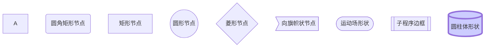

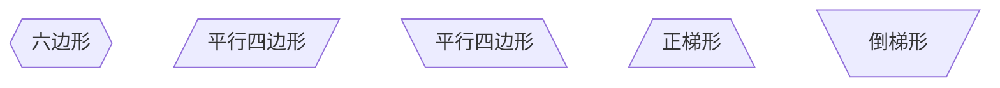


连线操作:

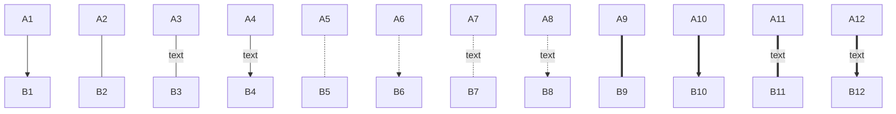

竖向流程图(mermaid模式)

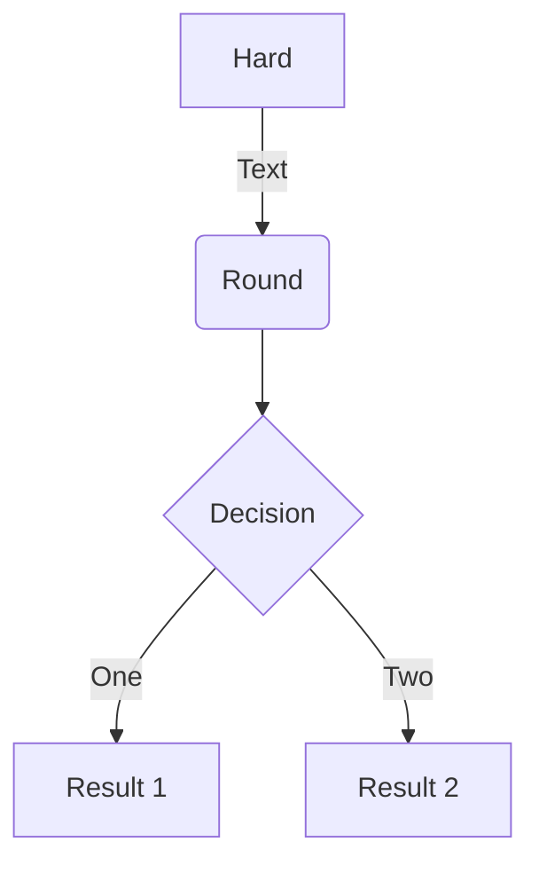


横向流程图(mermaid模式)

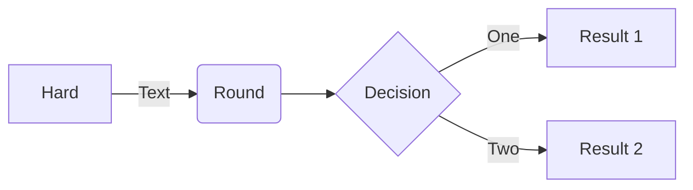

### 4.2 时序图

sequence模式:

```sequence
Title: 你好吗
小张->小李: 你好吗
Note right of 小李: 我是小李
Note left of 小张: 我是小张
Note over  小李:我今年20
Note over 小李,小张:我们是好朋友
小李-->小张: 我很好
小张->>小李: 你真的好吗
小李-->>小张: 大家好才是真的好
```


mermaid模式：

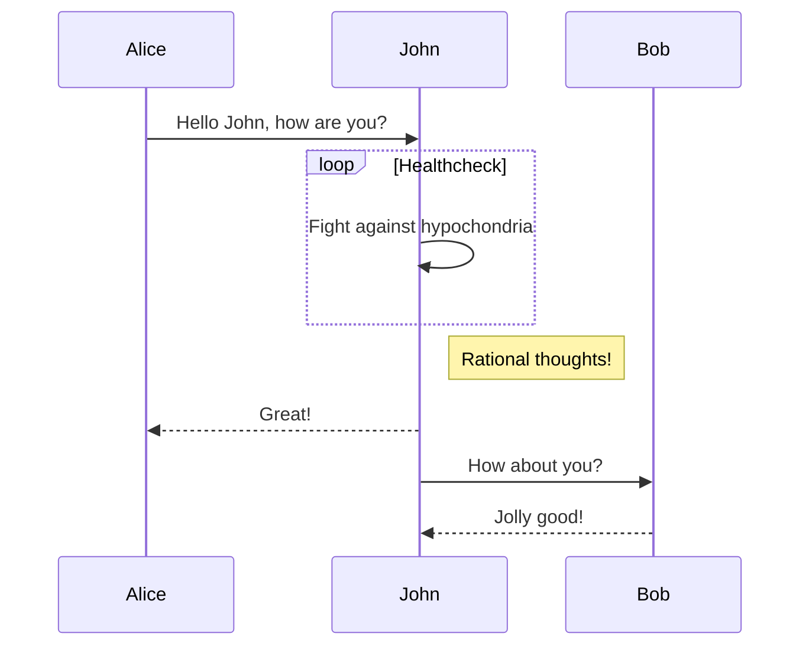


### 4.3甘特图

mermaid模式:

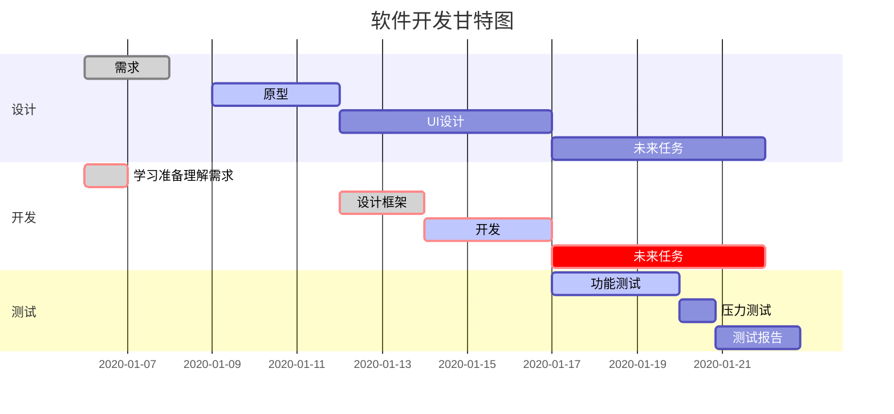

### 4.4 饼图

mermaid模式

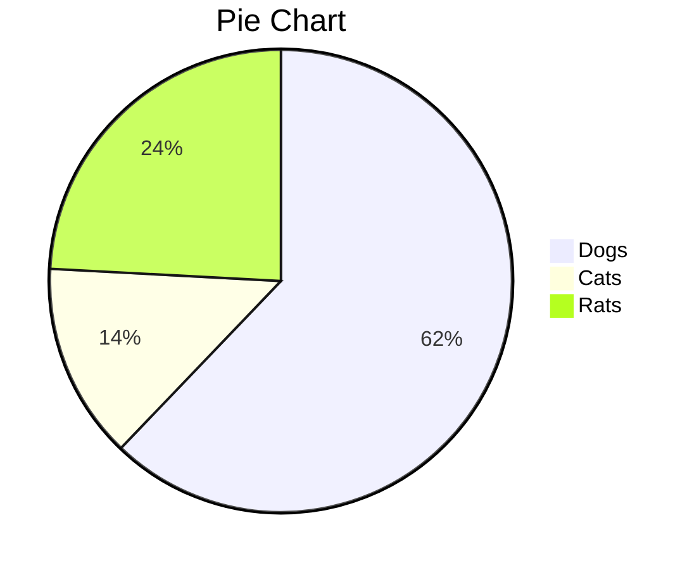


### 4.5状态图

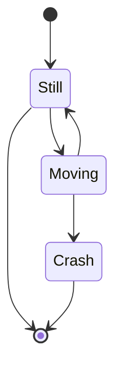

### 4.6类图

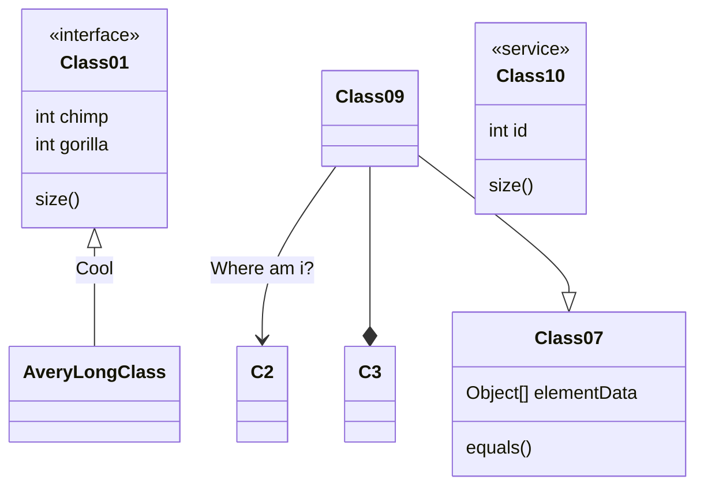

### 4.7 journey图

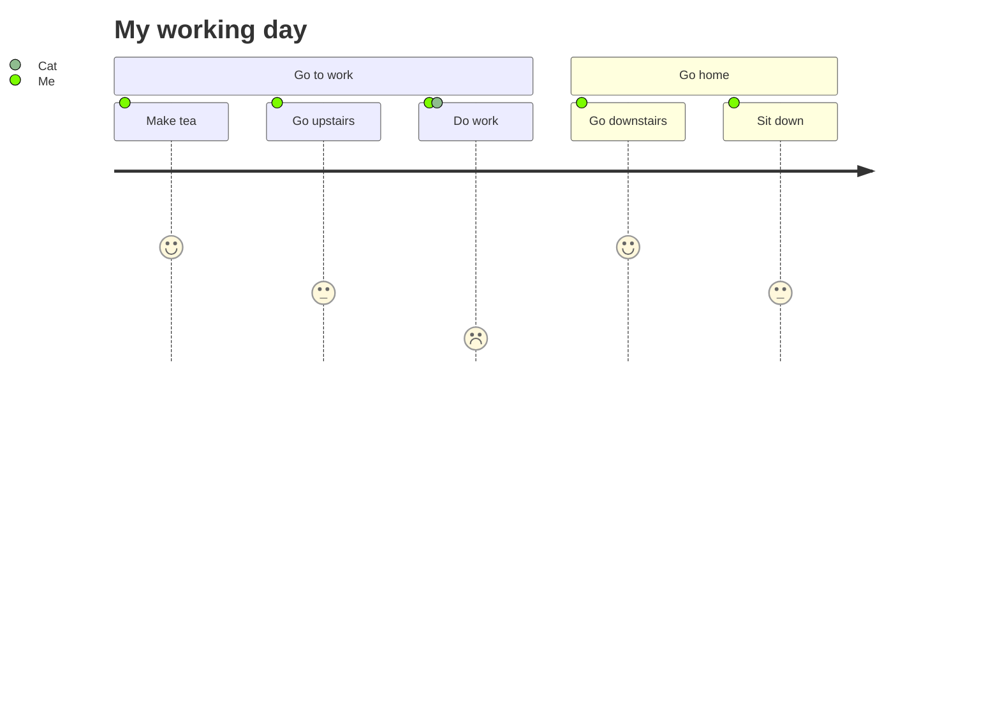

